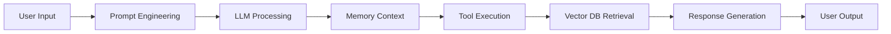

<div align="center">
  <!-- Large centered GIF – replace src with your own if needed -->
  
</div>

<br />

<div align="center">
  
</div>

<br />

<div align="center">

<!-- SOCIAL & PROFILE BADGES -->
<a href="https://linkedin.com/in/adityakumarjha-in">
  
</a>
<a href="https://twitter.com/AdityaK93865059">
  
</a>
<a href="https://instagram.com/_aadiiityaa_">
  
</a>
<a href="https://substack.com/@aadityaakumar">
  
</a>
<a href="https://medium.com/@adityaceo007">
  
</a>
<a href="mailto:adityaceo007@gmail.com">
  
</a>
<a href="https://adityakaportfolio.netlify.app/">
  
</a>

<br />

<!-- PROFILE VIEWS -->


<!-- EXTRA BADGES (followers, stars, etc.) -->
<a href="https://github.com/Aditya-myst?tab=followers">
  
</a>
<a href="https://github.com/Aditya-myst?tab=repositories">
  
</a>

</div>

<br />

<!-- STATS ROW -->
<div align="center">
  
  
</div>

---

## 👨‍💻 About Me

```javascript
const Aditya = {
  role: "AI Engineer & Full-Stack Developer",
  location: "India 🇮🇳",
  education: "B.Tech CSE",
  focus: [
    "AI Agents & LLMs",
    "Backend Systems & Scalable Architectures",
    "Automation & Workflow Optimization",
    "Product Development & Startups"
  ],
  currentlyBuilding: [
    "HookFlow - AI Workflow Automation",
    "MentoraAI - Personal AI Mentor",
    "AI Financial Advisor - Smart Investment Insights"
  ],
  philosophy: "Code is a tool. Solving problems is the goal.",
  funFact: "I love building things that don't exist yet"
}
```

### ⚡ Current Mission

- 🚀 Building AI-first products from scratch  
- 🧠 Learning advanced AI Engineering & LLM fine‑tuning  
- 🏗️ Backend System Design & Distributed Architecture  
- 📈 Growing **1% with AI** – daily learning  
- 📦 Shipping production‑ready projects consistently  

### 🌱 What I'm Learning Now

- Rust for high‑performance systems  
- Advanced RAG techniques with LlamaIndex  
- Kubernetes orchestration for AI workloads  
- Real‑time data streaming with Kafka  

---

## 🛠️ Tech Stack

### 🤖 Artificial Intelligence & ML


### 🚀 Backend Development


### 🎨 Frontend Development


### 🗄️ Databases


### ⚙️ DevOps & Tools


### 📚 Other Technologies


---

## 🚀 Featured Projects

### 🤖 HookFlow
AI workflow automation platform that connects LLMs with real‑world applications.  
**Tech:** `Python` `FastAPI` `LangChain` `React` `PostgreSQL` `Docker`  
[](#) [](#)

### 🧠 MentoraAI
Personal AI mentor for learning, career guidance, and skill development.  
**Tech:** `Next.js` `TypeScript` `OpenAI` `PostgreSQL` `TailwindCSS`  
[](#) [](#)

### 💰 AI Financial Advisor
AI‑powered financial insights and investment recommendations.  
**Tech:** `Python` `FastAPI` `LlamaIndex` `React` `MongoDB`  
[](#) [](#)

### 📦 More Open Source
- **[fat32-raw](https://github.com/meowrch/fat32-raw)** – Rust library for FAT32 partition access  
- **[HotKeyHub](https://github.com/meowrch/HotKeyHub)** – Cheat sheet for window manager keybindings  
- *...and many more on my GitHub*

---

## 🧠 AI Workflow



---

## 📈 GitHub Activity

<!-- Contribution Graph -->


<!-- Profile Summary -->


<div align="center">
  
  
</div>

---

## 🏆 GitHub Trophies

<p align="center">
  
</p>

---

## ✍️ Latest Blog Posts

<!-- BLOG-POST-LIST:START -->
- [How I Built an AI Workflow Automation in 7 Days](https://substack.com/@yourhandle/p/how-i-built-an-ai-workflow-automation)
- [The Future of LLM Agents in 2025](https://medium.com/@yourhandle/the-future-of-llm-agents)
- [Rust vs Python for AI: A Practical Comparison](https://dev.to/yourhandle/rust-vs-python-for-ai)
<!-- BLOG-POST-LIST:END -->

> **🔔 Follow me on [Substack](https://substack.com/@yourhandle) and [Medium](https://medium.com/@yourhandle) for weekly insights on AI Engineering, System Design, and Startup Life.**

---

## 🎓 Certifications & Achievements

- 🥇 **Winner** – International Hackathon 2024  
- 🥈 **Runner‑up** – AI Innovation Challenge 2023  
- 📜 **Certified AI Engineer** – Google  
- 📜 **Certified Full‑Stack Developer** – Meta  
- 📜 **State Register of Outstanding Abilities** – Russia (as DIMFLIX)

---

## 🏛️ My Organizations (Clickable)

| Organization | Description |
|--------------|-------------|
| [**Meowrch**](https://github.com/meowrch) | Open‑source Rust & system tools |
| [**Hackathons**](https://github.com/your-hackathon-org) | Team projects from hackathon wins |
| [**Designs**](https://github.com/your-design-org) | UI/UX and creative experiments |
| [**Education**](https://github.com/your-education-org) | Learning resources and tutorials |

---

## 📜 Patents

| Title | Number |
|-------|--------|
| **PRODUCTION OF SUPERLATEX** | RU2025668839 |
| *Additional patents pending* | – |

---

## 🏅 Significant Certificates

- **Цифровой прорыв. Сезон: Искусственный интеллект (2024)** – Окружной хакатон  
- **Цифровой прорыв. Сезон: Искусственный интеллект (2023)** – Международный хакатон  
- **Хакатон Агемийский** – Команда «ISON Stellantis», кейс «Детектор производственных дефектов»

*More certificates available on request.*

---

## ☕ Support My Work

If you like what I do and want to fuel my caffeine intake or support my open‑source projects, you can send a donation:

| Crypto | Address |
|--------|---------|
| **TON / USDT(TON)** | `UQB9qNTcAazAbFoeboebDPMML9MG73DUCAFTpVanQnLk3BHg3` |
| **USDT (TRC20)** | `TBTZ5RRMFGQQ8Vpf8i5N8DZhNxSum2r2As` |
| **Ethereum** | `0x56e8bf8Ec07b6F2d6aEdA7Bd8814DB5A72164b13` |
| **Bitcoin** | `bc1qt5urnw7esunf0v7e9az0jhatzrrdd0smem98gdn` |

---

## 💬 Let's Talk

I'm always open to:
- 🤝 Collaborations on interesting AI/OSS projects  
- 🎤 Speaking opportunities  
- 💡 Mentoring & advisory  
- 📝 Technical writing  

Feel free to reach out via any of the platforms above.

---

<p align="center">
  <i>“Think. Build. Ship. Repeat.”</i> 🚀
</p>

<div align="center">
  
</div>

---

**Note to self:** Replace all placeholder URLs (`yourhandle`, `youremail`, `your-banner-url`, etc.) and personal details before publishing. Also, you can enable the blog post feed by setting up a GitHub Action that updates the list automatically – see [github.com/gautamkrishnar/blog-post-workflow](https://github.com/gautamkrishnar/blog-post-workflow).


